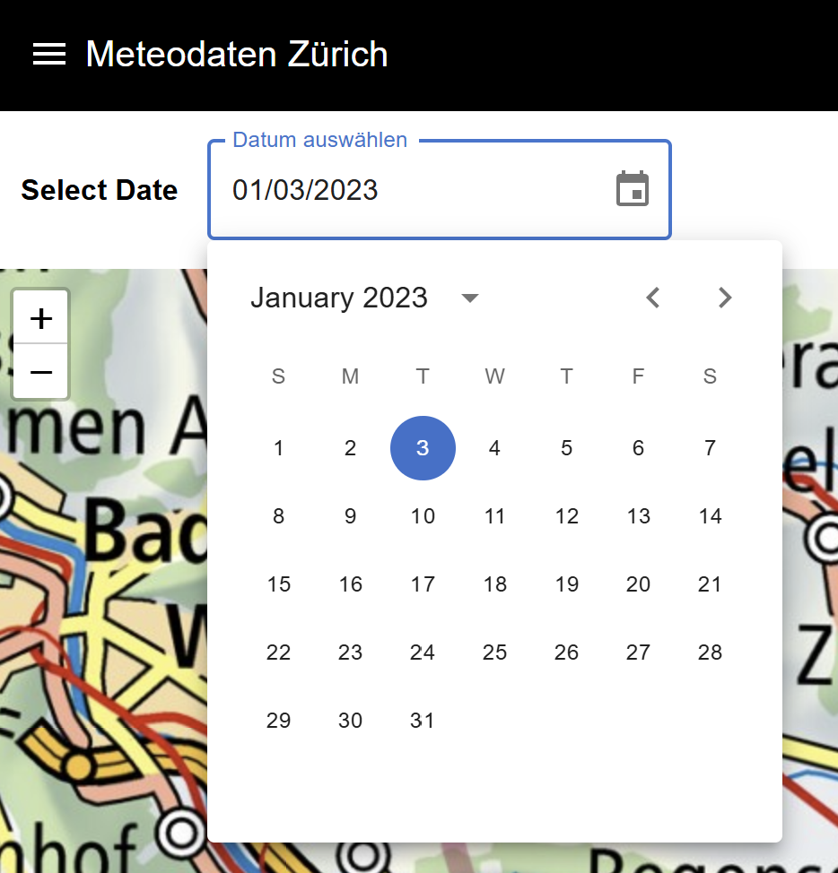
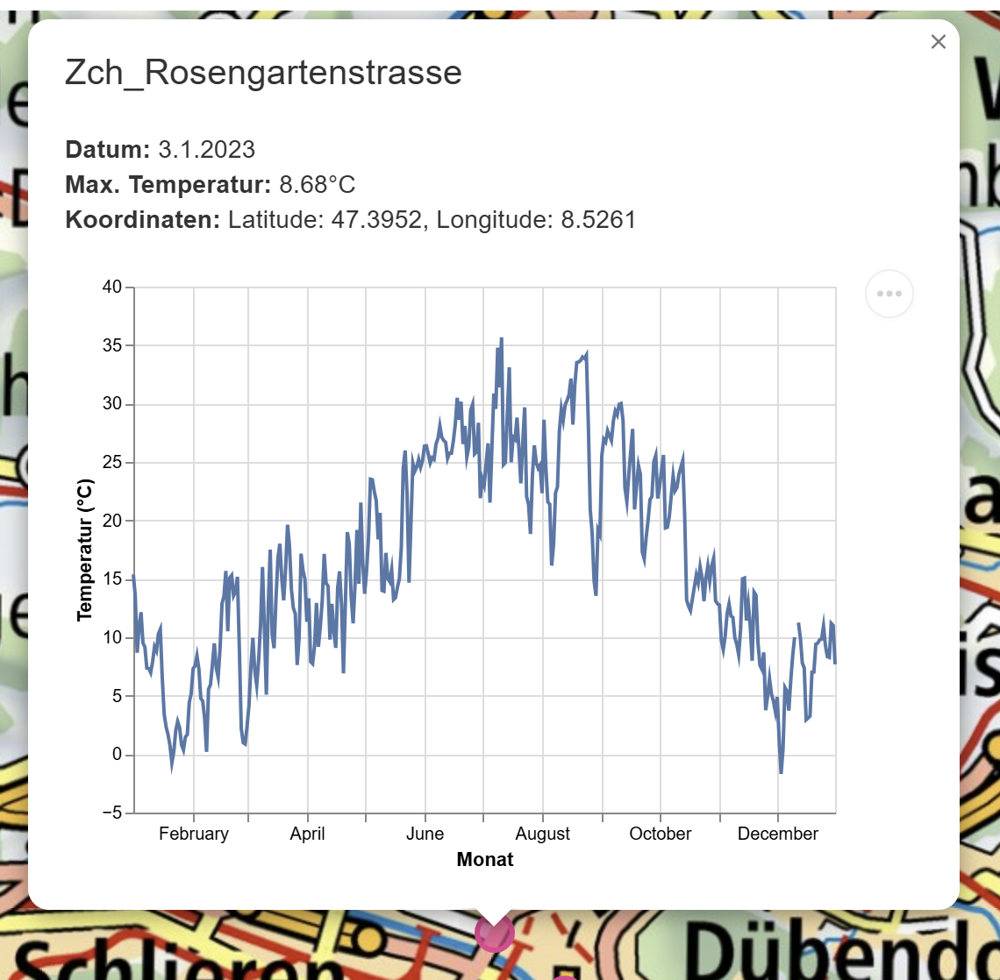
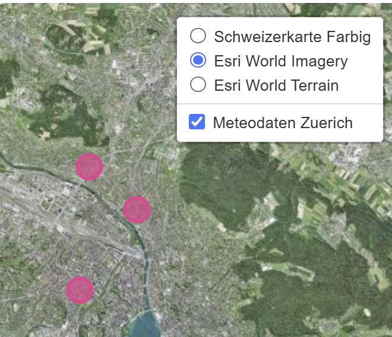

# Meteodaten-Webiste Zürich

Diese Website Stellt die Meteodaten aus dem Jahre 2023 dar.

Es sind 3 Wetterstationen verfügbar, welche Tägliche Temperatrudaten liefern. Mithilfe der Menuebar, kann ein gewünschtes Datum selektiert werden.

Durch das anwählen einer Messtation erhält man die Temperatur zum gewählten Datum sowie ein Scatterplot mit allen Daten von dieser Messtation.

Auch kann der Kartenhintergrund auf ein Höhenmodell oder ein Orthophoto gewechselt werden um die Übersicht zu vereinfachen.

Die Website ist im Web abrufbar und wird über Vercel gehostet
Link: https://3050fastapivercel.vercel.app/
